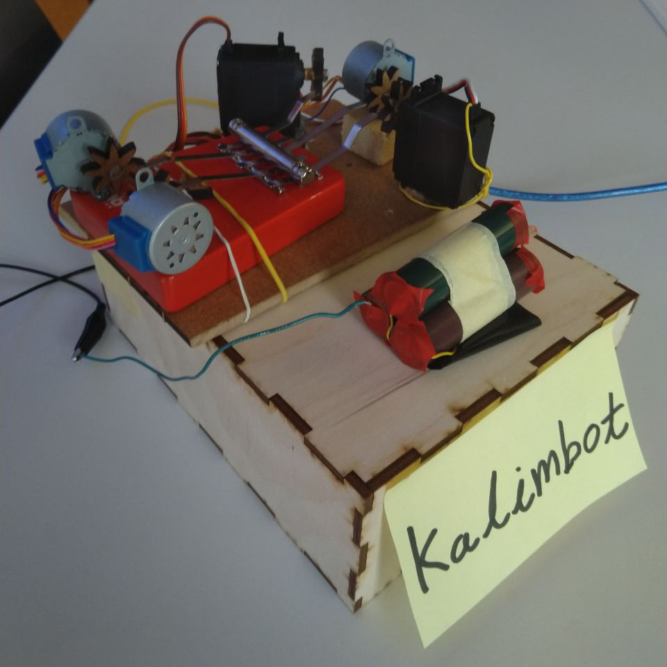

## **KALIMBOT** - A musical robot that plays the Kalimba

Project on [Devpost](https://devpost.com/software/kalimbot)

## Inspiration
Build a remote controlled musical robot that plays an instrument built for humans.

## What it does
The robot plays a Kalimba using 5 actuated motors/servos. It can play human input live and MIDI files.

## How we built it
Bought a Kalimba, wrote code to actuate the motors 

## Challenges we ran into
Hardware, especially motor boards, Bluetooth MIDI RX callbacks, Latency

## Accomplishments that we're proud of
It works!!, live MIDI to Serial, Remote control through WIFI

## What we learned
Arduino, C++, Python, Laser cutting, working with motors/servos/steppers 

## What's next for Kalimbot
add random note generator, add motors for full chromatic scale (12 semitones)